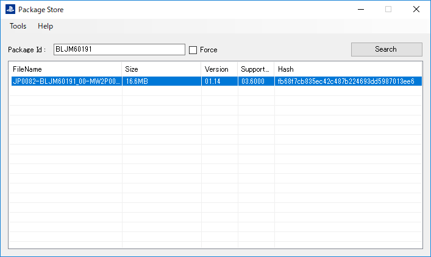

  

  <h3 align="center">PackageStore</h3>

  
PS Store(CD only) パッケージ検索ツール

  

    <a href="https://github.com/coreizer/PackageStore/issues">バグレポート</a>
    ・
    <a href="https://github.com/coreizer/PackageStore/issues">機能リクエスト</a>
  

  
コンテンツ一覧

  <ol>
    <li><a href="#👀-featured">機能</a></li>
    <li><a href="#🖼️-screenshot">スクリーンショット</a></li>
    <li><a href="#🙏-additional-resources-and-thanks">感謝</a></li>
    <li><a href="#👷-author">著者</a></li>
    <li><a href="#🌏-stay-in-touch">連絡</a></li>
    <li><a href="#⚖️-license">ライセンス</a></li>
  </ol>

## 👀 機能

- パッケージ検索
- 簡単なダウンロードマネージャー
- 検索履歴
- redump's のデータベースを利用したパッケージ Id のサジェスト機能
- 多言語対応: 英語、日本語 (フォームのみ)

## 🖼️ スクリーンショット

## 🙏 感謝

- [PS3 Developer Wiki - Environments](https://www.psdevwiki.com/ps3/Environments)
- [ByteSize - Utility](https://github.com/omar/ByteSize)
- [redump.org](http://redump.org/)
- [AngleSharp](https://github.com/AngleSharp/AngleSharp)
- [Enums.NET](https://github.com/TylerBrinkley/Enums.NET)
- [Fody](https://github.com/Fody/Fody)

## 🌏 連絡

- [Website (coreizer.dev)](https://www.coreizer.dev)
- [Twitter](https://www.twitter.com/coreizer)

## 👷 著者

- coreizer

## ⚖️ ライセンス

このプロジェクトのライセンスは[GPL v3.0](https://opensource.org/license/lgpl-3-0/)です.詳細は [License File](LICENSE) を参照してください.
